# Пользовательский сценарий "Удаление заметки"

## Действующие лица:

1. Пользователь
2. Приложение
3. Бэк
4. База данных

## Предварительные условия

Пользователь должен находиться на главном экране.

## Выходные условия

В системе больше нет заметки, которую выбрал и удалил пользователь.

## Основной сценарий

1. Пользователь нажимает на заметку, которую хочет удалить.

2. Приложение открывает окно с формой редактирования заметки.

3. Пользователь нажимает кнопку **Удалить**. 

4. Приложение открывает окно с выбором из двух вариантов: **Да** и **Нет**.

5. Пользователь нажимает кнопку **Да**.

6. Приложение отправляет бэку запрос на удаление заметки DELETE http://notesapp.su/api/notes/{id}

7. Бэк удаляет заметку в базе данных.

8. Бэк возвращает приложению ответ 204 OK. 

6. Приложение открывает уведомление **Заметка успешно удалена**.

## Альтернативные сценарии

### Удаление отменено до подтверждения

1. Пользователь нажимает на заметку, которую хочет удалить.

2. Приложение открывает окно с формой редактирования заметки.

3. Пользователь нажимает кнопку **Мои заметки**. 

4. Приложение закрывает окно и открывает главный экран.

### Удаление не подтверждено

1. Пользователь нажимает на заметку, которую хочет удалить.

2. Приложение открывает окно с формой редактирования заметки.

3. Пользователь нажимает кнопку **Удалить**. 

4. Приложение открывает окно подтверждения удаления с выбором из двух вариантов: **Да** и **Нет**.

5. Пользователь нажимает кнопку **Нет**.

6. Приложение закрывает окно подтверждения удаления и открывает окно с формой редактирования заметки.

## Диаграмма последовательности

```plantuml

@startuml
actor Пользователь as user
participant Приложение as client
participant Бэк as server
database "База данных" as db
@enduml

user -> client: Нажимает на заметку
user <-- client: Открывает форму редактирования заметки
user -> client: Нажимает кнопку "Удалить"
user <-- client: Открывает окно с выбором из двух вариантов: "Да" или "Нет"
user -> client: Нажимает "Да"
client -> server: Запрос DELETE http://notesapp.su/api/notes/{id}
server -> db: Удаляет заметку
server <-- db: Заметка удалена
client <-- server: 204 OK
user <-- client: Открывает окно "Заметка успешно удалена"

alt Альтернативный сценарий
user -> client: Нажимает на заметку
user <-- client: Открывает форму редактирования заметки
user -> client: Нажимает на кнопку "Мои заметки"
user <-- client: Закрывает окно и открывает главный экран
end alt

alt Альтернативный сценарий 2
user -> client: Нажимает на заметку
user <-- client: Открывает форму редактирования заметки
user -> client: Нажимает кнопку "Удалить"
user <-- client: Открывает окно с выбором из двух вариантов: "Да" или "Нет"
user -> client: Нажимает "Нет"
user <-- client: Закрывает окно с выбором
end alt
```

